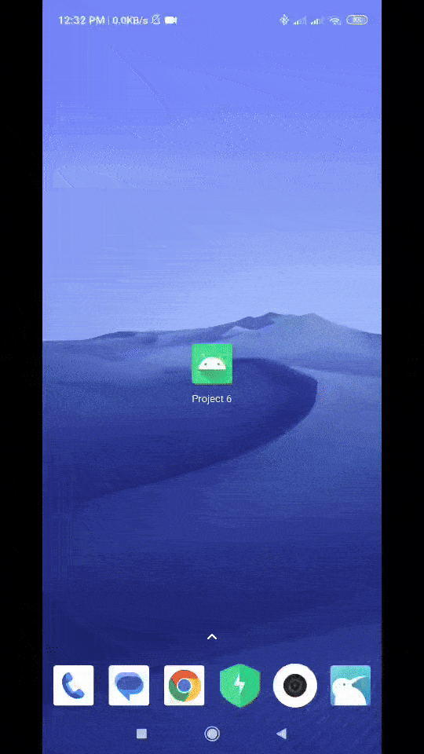

# Android Project 6 - *BitFit Part 2*

Submitted by: **Sami Kuloglu**

**BitFit Part 2** is a health metrics app that allows users to track ... [TODO] 

Time spent: **42** hours spent in total

## Required Features

The following **required** functionality is completed:

- [x] **Use at least 2 Fragments** (Created Two Fragments LogFragment & Dashboard Fragment)
- [x] **Create a new dashboard fragment where users can see a summary of their entered data** (Dashboard Fragment (2nd Fragment) is created where yser can see a summary of their entered data)
- [x] **Use one of the Navigation UI Views (BottomNavigation) to move between the fragments** (Bottom Navigation is used)

## Video Walkthrough

Here's a walkthrough of implemented user stories:

## License

    Copyright [2024] [Sami Kuloglu]

    Licensed under the Apache License, Version 2.0 (the "License");
    you may not use this file except in compliance with the License.
    You may obtain a copy of the License at

        http://www.apache.org/licenses/LICENSE-2.0

    Unless required by applicable law or agreed to in writing, software
    distributed under the License is distributed on an "AS IS" BASIS,
    WITHOUT WARRANTIES OR CONDITIONS OF ANY KIND, either express or implied.
    See the License for the specific language governing permissions and
    limitations under the License.
